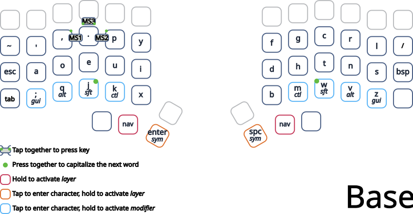
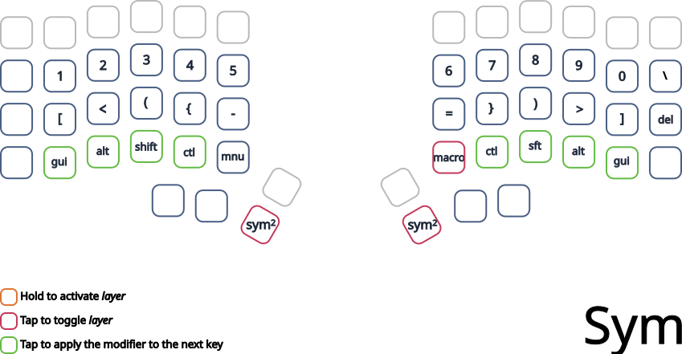
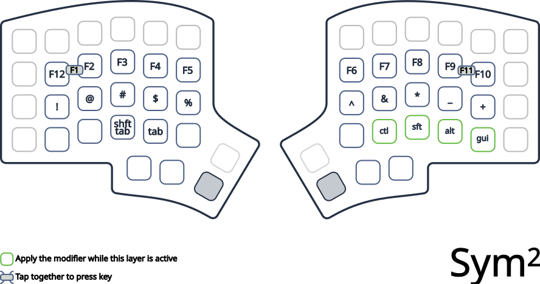
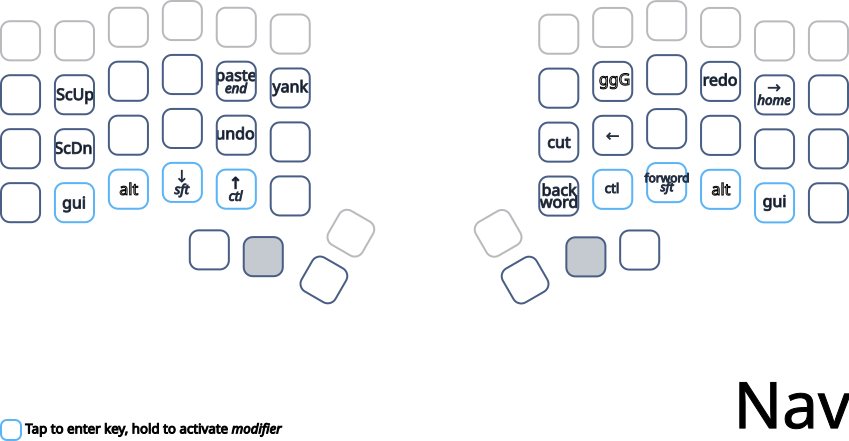
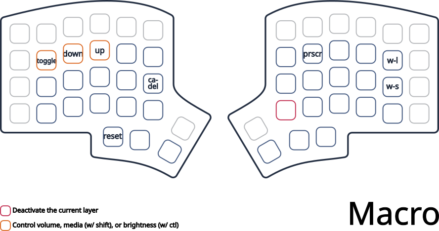

# elpfen's keymap

This is my daily-driver layout that I use for programming and text-editing. It's
designed to be useful in Xmonad, tmux, vim, and Windows. It was designed 
originally with a Keebio Iris in mind but is adaptable to any 3x10 + thumb 
layout.

## Basic Principles

- **Keep it simple**: We quickly approach diminishing returns when adding keys
    and functionality to our layout and it's preferable to skip the rarely used
    keys than add rarely-needed complexity to our layout.

- **Maximize accessibility, minimize travel**: frequently used keys should be more
    accessible than infrequently used keys. Only very infrequently used actions
    should be more than 1 key from home row. Layers and modifiers do not add 
    significant impediments to accessibility.

- **Consistency is important too**: accessibility and travel can be sacrificed if a
    key's function is consistent with a less accessible position (e.g. putting
    Shift-Tab and Tab on JK despite being used frequently because it's 
    consistent with other uses of JK).

- **Symmetry and ping-ponging**: The pattern of alternating hands that Dvorak
    enables should be maintained with the layout. Both hands should be used
    roughly equally. All modifiers and layers should be symmetric and accessible
    from both hands to avoid "clawing" (holding a key and tapping a key with the
    same hand).

- **Two mods and one tap, max**: Layout should be designed so that no more than two
    mods need to be held at once on a given hand, and that for any action, one
    hand holds a key and the other taps (again, no clawing).

- **Don't fear the layers/modifiers**: With a little practice, layer-taps can be
    used with great precision and speed. Special note should be taken not to put
    characters on another layer if they can be achieved with a modifier (e.g.
    putting shifted symbols on ADJ)

## Other Opinions

- Of course Dvorak is the best layout (don't @ me) but more to the point it's
    particularly useful to designing keymaps because it's already arranged with
    key-frequency in mind.  The home row has the most-frequently used keys, the
    top the second most-frequently used, and the bottom has the least-frequently
    used. This means that we can have consistent, symmetric modifiers on the
    least used keys without a second thought.

- I prefer modifiers on the bottom row than the home row or top row. Partly
    because of the key-frequency explained above, but I also simply find it
    more comfortable to hold bottom row keys than top or home row keys.

## Special Features

All of these features are ways of adding more functionality to layers and 
reducing the number of keys that need to be held at a given time.

### Layer-Lock
Hold a layer-tap to enter the NAV layer then tap a key to "lock in" the NAV 
layer. The layer will stay active until the lock key is tapped again. I 
frequently find that I will enter the NAV layer, move around a bit and then 
realize I will need to do quite a bit of work in this layer.

### Switchboard

From a parent layer, activate a child layer and keep it active until the parent 
layer is deactivated. This effectively gives access to multiple layers from a 
single layer-tap, minimizing the number of layer-taps keys needed to access 
every layer while using only a single key as the layer-tap.

Example: SYM -> MCR, NAV -> MOUSE

### Layer-Sticky Mods

Basically the same as the above but for modifiers as well. The modifier stays on
so long as the layer it was on stays active. Extremely useful on the ADJ layer
for scrolling through tabs/windows with Ctl-Tab and Alt-Tab.

### Lenient Tri-Layer

Tri-layer usually works by activating the ADJ layer so long as RAISE and LOWER
are both active. I've altered it very slightly so that ADJ is still activated
when RAISE and LOWER are both active, but deactivates ADJ only when _both_ RAISE
and LOWER are deactivated. This is functionally very similar to Switchboard
except that it doesn't matter which of the two keys is pressed first, so it's
easier to activate.

# Layers

## Base Layer

## Symbols (SYM)

Numbers and symbols are balanced across the two hands. Symbols are placed on the
home row as they're generally used more than numbers or number symbols.

- SwMcr: Switchboard to the MCR layer. This will toggle on the MCR layer and
    deactivate it when the SYM layer is deactivated.

Note: `()` is typed pretty frequently and often leads to clawing as it's pretty
awkward to immediately switch from one thumb to the other. It's not ideal, but
it's fine.

## Sym^2

## Navigation/Vimmish (NAV)

Navigation and operations in a vimmish layout.

This layer features "layer lock" on the NavLock key.

- NavLok: Lock in this layer
- SwMouse: Switchboard to the Mouse layer.
- ⇈⇊ (ggG): Double tap for document home, tap for document end

## Macros/Utility (MCR)
Utility keys and macros that are used relatively infrequently.

- VMBDn/Up/Mut (Volume-Media-Brightness): Volume on regular tap, media on
    ctl+tap, brightness on shift-tap. They're put on the angle-bracket keys and
    which sorta point in the right directions.

- Lock: Win-L on L key for mnemonic "Lock"
- CAD/Unlok: Ctl-Alt-Delete on U for "Unlock"
- Sleep: on S key for "Sleep"
- CtShEsc: Ctl-Sh-Esc on somewhat close to Escape
- PrntScr: PrntScr on G for "screenGrab"

# License
Copyright 2021 Charles Schimmelpfennig aka elpfen

This program is free software: you can redistribute it and/or modify 
it under the terms of the GNU General Public License as published by 
the Free Software Foundation, either version 2 of the License, or 
(at your option) any later version. 

This program is distributed in the hope that it will be useful, 
but WITHOUT ANY WARRANTY; without even the implied warranty of 
MERCHANTABILITY or FITNESS FOR A PARTICULAR PURPOSE.  See the 
GNU General Public License for more details. 

You should have received a copy of the GNU General Public License along with 
this program.  If not, see <http://www.gnu.org/licenses/>. 
